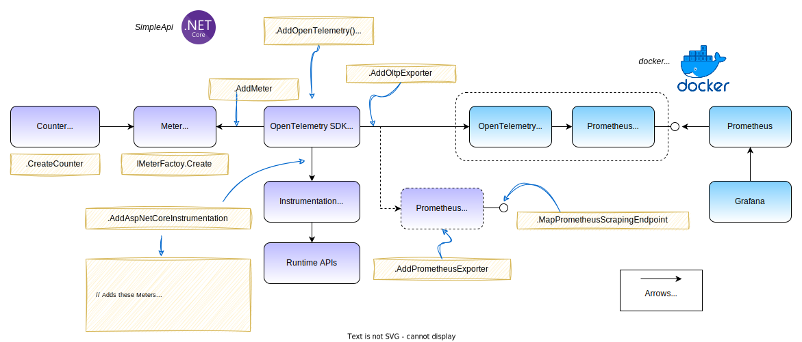

# Open Telemetry Demo with .NET 8

This demo shows how to use Open Telemetry with .NET 8 to instrument a simple web application. It sends traces to Jaeger and metrics to Prometheus and Grafana.

Grafana has been pre-fitted with slightly modified versions of James Newton-King's ASP.NET Core 8 Grafana dashboards to show off some of the new metrics.



## Prequisites

- .NET 8 SDK
- Docker Desktop, or Docker + Docker Compose
- Tested on Mac OS Sonoma with M1 and M2 chips, and on Windows 11

## Run the telemetry backends

From the root of the repository, run:

```
docker compose up
```

This will start Prometheus, Grafana and Jaegar, and the Otel Contrib Collector. The collector will receive telemetry from the demo application over gRPC using OTLP protocol and forward it to the backends.


## Running the Demo Application

From the root of the repository, run:

```
dotnet run --project src/SimpleAPI
```

This will start a simple web api on https://localhost:8080.

## Generating Telemetry

If you are using Visual Studio Code with an extension like REST Client, or Rider's scratch pad, then you can use the `test.http` file to generate some individual requests to the API.

Alternatively, you can run the load tests using k6 with the following command, from the root of the repository. This will send a decent amount of traffic to the API and generate some interesting telemetry, including some calls that will fail with 404 and 500 errors.

```
docker run --name k6 -v ${PWD}/load-test.js:/load-test.js --rm grafana/k6 run --insecure-skip-tls-verify --vus 10 -d 1m /load-test.js
```

## Browse Telemetry

- Grafana at http://localhost:3000 - here you can explore the ASP.NET dashboards and try creating your own for the custom metric "simpleapi.roll_die_roll_count".
- Jaegar at http://localhost:16686 - here you can explore traces.

## How everything is configured

Configuration is mapped into the various contains using Docker volumes in the [docker-compose.yaml](docker-compose.yaml) file. The purpose of exposed ports and files is described in the comments in that file.

The file [otel-collector-config.yaml](otel-collector-config.yaml) configures the Otel Contrib Collector to receive telemetry from the demo application over gRPC using OTLP protocol and forward it to the backends.

The folder [grafana-config](grafana-config) contains various configuration files and JSON files that configure the Grafana dashboards. You can read about provisioning Grafana [here](https://grafana.com/docs/grafana/latest/administration/provisioning/).

The file [prometheus.yaml](prometheus.yaml) configures Prometheus to scrape metrics from the Otel Contrib Collector.


## Find Out More!

- Find out all about Open Telemetry [here](https://opentelemetry.io).
- See https://github.com/open-telemetry/opentelemetry-dotnet for general configuration and tons of links to .NET specific documentation including getting started guides.
- Grafana: https://grafana.com/docs/grafana/latest/?pg=oss-graf&plcmt=quick-links
- Promethus: https://prometheus.io/docs/introduction/overview/
- Jaegar: https://www.jaegertracing.io/docs/1.51/getting-started
- K6 Loading Testing Tool: https://k6.io/docs/
- New ASP.NET Core Metrics: https://learn.microsoft.com/en-us/dotnet/core/diagnostics/built-in-metrics-aspnetcore
- Testing metrics: https://learn.microsoft.com/en-us/aspnet/core/log-mon/metrics/metrics?view=aspnetcore-8.0#test-metrics-in-aspnet-core-apps
- James Newton-King's ASP.NET Core 8 Grafana dashboards: https://github.com/JamesNK/aspnetcore-grafana
